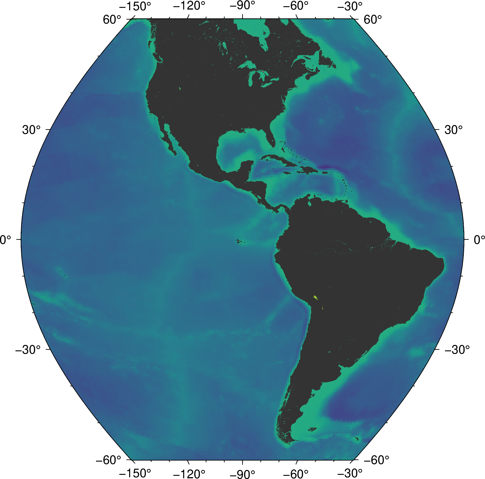

<!--
-------------------------------------------------------------------------------
This file defines the contents of each slide.
The reveal.js configuration can be found in index.html
-------------------------------------------------------------------------------
-->


<!-- .slide: class="slide-title" data-background-color="#262626" data-background-size="contain" -->

<!-- Place the content at the bottom of the slide -->
<div class="r-stretch">
</div>

<h1 id="talk-title">
  Apresentação do Plano de Aula
</h1>

## Introdução à Sísmica (Teoria)

<p id="talk-authors">
  <a>Yago M Castro</a>
</p>

<!-- Place location and date side-by-side with affiliation logos -->
<div class="row talk-info">
<div class="col-large">

<i class="fa fa-calendar-alt" style="margin: 0 10px 0 0"></i>
05 de Novembro de 2024
<span style="margin: 0 20px"></span>
Atividade 10 | Preparação Pedagógica

<!-- Permission to reuse and CC-BY license logo -->
<i class="fa fa-camera" style="margin: 0 10px 0 0"></i>
Sinta-se à vontade para tirar capturas de tela/compartilhar/reutilizar esta apresentação
<span style="margin: 0 20px"></span>
<a href="https://creativecommons.org/licenses/by/4.0/"><i class="fab fa-creative-commons"></i><i class="fab fa-creative-commons-by" style="margin: 0 10px 0 2px"></i>CC-BY 4.0 License</a>

</div>
<div class="col-medium">

<!-- Add logos here. Need these wrappers to align them to the bottom right -->
<div class="talk-logos-container">
<div class="talk-logos">
  <a href="https://www.compgeolab.org"></a>
  <a href="https://www.iag.usp.br/"></a>
  <a href="https://www.usp.br/"></a>
</div>
</div>

</div>
</div>

===============================================================================

# Objetivos da Aula

- Compreender os conceitos fundamentais de sísmica e a **propagação de ondas sísmicas em diferentes meios**.
- Classificar as ondas sísmicas em ondas **P, S e de superfície**, identificando suas principais características e comportamentos.
- Relacionar a propagação de ondas sísmicas com **aplicações práticas na exploração geofísica**, como a análise de estruturas da subsuperfície e a detecção de recursos naturais.
- Preparar os alunos para as próximas aulas sobre **aquisição e processamento de dados sísmicos**, conectando teoria à prática.

===============================================================================

# Contextualização no plano semestral

## Programa da Disciplina

- Apresentada na **semana 11**
- Primeira aula sobre **sísmica**
- Marca a transição do estudo de **métodos potenciais** (gravimetria e magnetometria) para os **métodos sísmicos**

===============================================================================


# Contextualização no plano semestral

## Base Prévia 
- **Propriedades físicas** das rochas
- **Estrutura interna** da Terra
- Fundamentos da **aquisição e processamento de dados geofísicos** aplicados a gravimetria e magnetometria

===============================================================================

# Contextualização no plano semestral
## Continuidade 
- **Aquisição** de dados sísmicos
- Aulas sobre **processamento de dados**
- **Integração** com outros métodos geofísicos

===============================================================================

# Etapas da Aula e Recursos Utilizados

1. **Abertura (10 minutos)**
    - **Discussão Guiada**: Qual é a importância da sísmica na geofísica moderna? (7 minutos)
    - **Apresentação em vídeo**: [3-component Seismograms—Capturing the motion of an earthquake. (Educational)](https://www.youtube.com/watch?v=Za_22xo7ZQQ) (3 minutos)
2. **Fundamentos Teóricos (20 minutos)**
    - **Tipos de Ondas Sísmicas**:
        - **Ondas P (primárias)**: compressão e propagação rápida. $V_p = \sqrt{\frac{K + \frac{4}{3} \mu}{\rho}}$
        - **Ondas S (secundárias)**: cisalhamento e propagação mais lenta. $V_s = \sqrt{\frac{\mu}{\rho}}$
        - **Ondas de Superfície**: ondas Love e Rayleigh.

===============================================================================

# Etapas da Aula e Recursos Utilizados

3. **Apresentação (10 minutos)**
    - Como as ondas sísmicas podem ser usadas para detectar diferentes camadas da Terra.
    - [Tremilique](https://github.com/leouieda/tremelique)
4. **Exercícios em sala (10 minutos)**
    - Cálculos de tempos de chegada de ondas em diferentes meios usando exemplos simplificados.

===============================================================================

# Etapas da Aula e Recursos Utilizados

5. **Exercícios para casa (slide da aula e Moodle)**
    - Exercícios relacionados aos conteúdos abordados em sala de aula
    - **Desafios**: 
        - Utilizar [Tremilique](https://github.com/leouieda/tremelique) para representar um sistema com propriedades específicas 
        - Representar um "terremoto" utilizando [Tremilique](https://github.com/leouieda/tremelique) 

===============================================================================

# Tremelique

<div class="row">
<div class="col-small small">

```python
import tremelique as tr
import numpy as np

shape = (300, 400)
spacing = 5
extent = [0, shape[1]*spacing, shape[0]*spacing, 0]
velocity = np.zeros(shape, dtype='float32') + 1500  # m/s
density = np.zeros(shape, dtype='float32') + 1000  # kg/m³

pwave = tr.Acoustic(velocity, density, spacing=spacing)
pwave.add_point_source((0, shape[1]//2), tr.RickerWavelet(1, 60))
pwave.run(800)
pwave.animate(every=10, embed=True, dpi=50, cutoff=0.5)
```
</div>
<div class="col-large small">

<video  controls>
  <source src="assets/simulation1.mp4" type="video/mp4">

</video>

</div>


===============================================================================


# Tremelique

<div class="row">
<div class="col-small">

```python
import tremelique as tr
import numpy as np

shape = (300, 400)
spacing = 5
extent = [0, shape[1]*spacing, shape[0]*spacing, 0]
velocity = np.zeros(shape, dtype='float32') + 1500  # m/s
density = np.zeros(shape, dtype='float32') + 1000  # kg/m³

pwave = tr.Acoustic(velocity, density, spacing=spacing)
pwave.add_point_source((0, shape[1]//2), tr.RickerWavelet(1, 60))
pwave.add_point_source((0, 50), tr.RickerWavelet(1, 60))
pwave.add_point_source((0, 350), tr.RickerWavelet(1, 60))
pwave.run(800)
pwave.animate(every=10, embed=True, dpi=50, cutoff=0.5)
```
</div>
<div class="col-large">

<video  controls>
  <source src="assets/simulation2.mp4" type="video/mp4">

</video>

</div>


===============================================================================


# Tremelique

<div class="row">
<div class="col-small small">

```python
import tremelique as tr
import numpy as np

shape = (300, 400)
spacing = 5
extent = [0, shape[1]*spacing, shape[0]*spacing, 0]
velocity = np.zeros(shape, dtype='float32') + 1500  # m/s
density = np.zeros(shape, dtype='float32') + 1000  # kg/m³
velocity[50:] = 3000
density[50:] = 2000
velocity[70:] = 3500
density[70:] = 4500

pwave = tr.Acoustic(velocity, density, spacing=spacing)
pwave.add_point_source((0, shape[1]//2), tr.RickerWavelet(1, 20))
pwave.add_point_source((0, 50), tr.RickerWavelet(1, 20))
pwave.add_point_source((0, 350), tr.RickerWavelet(1, 20))
pwave.run(1000)
pwave.animate(every=10, embed=True, dpi=50, cutoff=0.5)
```
</div>
<div class="col-large">

<video  controls>
  <source src="assets/simulation3.mp4" type="video/mp4">

</video>

</div>


===============================================================================

# Tremelique

<div class="row">
<div class="col-small">

```python
import tremelique as tr
import numpy as np

shape = (300, 400)
spacing = 5
extent = [0, shape[1]*spacing, shape[0]*spacing, 0]
velocity = np.zeros(shape, dtype='float32') + 1500  # m/s
density = np.zeros(shape, dtype='float32') + 1000  # kg/m³

pwave = tr.Acoustic(velocity, density, spacing=spacing)
pwave.add_point_source((100, 200), tr.RickerWavelet(1, 60))
pwave.run(300)
pwave.animate(every=10, embed=True, dpi=50, cutoff=0.5)
```
</div>
<div class="col-large">

<video  controls>
  <source src="assets/simulation4.mp4" type="video/mp4">

</video>

</div>


===============================================================================
<div class="r-stretch centered">
<div>

# Even more facts!

About many different things.

</div>
</div>
<div class="footnote-left">

Left aligned footnote.
Use `centered` on the `div` above to vertically center content.
<br>
Need to put another `div` inside of it as well.

</div>

===============================================================================

<!-- .slide: data-background-image="assets/agu2019.svg" data-background-size="contain" data-background-color="#000000" -->

<div class="r-stretch">
</div>
<div class="footnote-center dark">

Centered footnote with a dark background on a slide with a background.
<br>
Set the size to `contain` to make sure aspect ratios are preserved and the
background isn't cropped.
<br>
It's a good idea to add alt-text to this footnote if the background is
important.

</div>

===============================================================================

<!-- .slide: data-background-video="assets/brasil-sao-paulo-rio.mp4" data-background-size="contain" data-background-color="#000000" -->

<div class="r-stretch">
</div>
<div class="footnote">

This is how you use a video background.
The video auto starts when flipping to this slide.

</div>

===============================================================================

<!-- .slide: class="slide-transition" -->

# A transition slide <br> with a large title

...and some text.

===============================================================================

# Maths

This is an inline $\int_a^b x^2 dx$ and $\delta g = g - \gamma$:

`\[ \int_a^b x^2 dx \]`

===============================================================================

<!-- .slide: data-background-image="assets/agu2019.svg" data-background-size="contain" data-background-opacity="0.3" data-background-color="#000000" -->

<div class="quote">

Big quote message with a faded background image.
Bla bla bla bla bla bla bla bla bla bla bla bla bla bla bla.

</div>

===============================================================================

<!-- .slide: data-background-image="assets/agu2019.svg" data-background-size="contain" data-background-opacity="0.3" data-background-color="#ffffff" -->

<div class="quote dark">

Light fade of the background with a dark quote.

</div>

===============================================================================

# Two column layout

<div class="row">
<div class="col">

## Theory

Explain something here.
This is how you make a FontAwesome list:

<ul class="fa-ul">

<li>
<span class="fa-li"> <i class="fa fa-lightbulb fa-fw"></i> </span>
Make a list with
</li>

<li>
<span class="fa-li"> <i class="fa fa-file-alt fa-fw"></i> </span>
some awesome icons
</li>

<li>
<span class="fa-li"> <i class="fa fa-users fa-fw"></i> </span>
instead of bullet points
</li>

</ul>

</div>
<div class="col tiny">


Some text explaining the figure.
Maybe even a bit of maths like $\gamma$.

</div>
</div>

<div class="footnote">

Good place for a citation or image credit.
This one is by Leonardo Uieda (CC-BY).

</div>

===============================================================================

<div class="r-stretch centered">
<div>

# Multiple columns

Place as many `col`s as you want. They will have the same size.

<div class="row">
<div class="col">

Bla bla bla bla bla bla bla bla bla bla bla bla bla bla bla bla bla bla bla bla
bla bla.

</div>
<div class="col tiny">


Bla bla bla bla bla bla bla bla bla bla bla bla bla bla bla bla bla bla bla bla
bla bla.

</div>
<div class="col tiny">


Bla bla bla bla bla bla bla bla bla bla bla bla bla bla bla bla bla bla bla bla
bla bla.

</div>
</div>

</div>
</div>
<div class="footnote">

Images by Leonardo Uieda (CC-BY).

</div>

===============================================================================

# This one has columns of different size

<div class="row">
<div class="col-large tiny">


This way the image is larger on the screen. Use it for maps or main figures.

</div>
<div class="col small">

Explain what is shown on the image.
Use the `small` class to adjust font size.

Maybe include some maths:

$ D\dfrac{\partial^4 w}{\partial x^4} = q - g (\rho_m - \rho_w) w $

</div>
</div>

===============================================================================

<div class="row">
<div class="col tiny">


This way the image is narrow so it should be in a smaller column.

</div>
<div class="col-medium">

# Column sizes

Columns come in 3 sizes:

1. `col`
1. `col-medium`
1. `col-large`

These are more proportions than fixed sizes.

</div>
</div>

===============================================================================

# Code

Example of using PyGMT to make a map:

<div class="row">
<div class="col-large fragment small">

This code:

```python
import pygmt

# Load built-in topography data
grid = pygmt.datasets.load_earth_relief()

fig = pygmt.Figure()
# Pseudo-color map of topography
fig.basemap(
    region=[-150, -30, -60, 60],
    projection="I-90/6i",
    frame=True,
)
fig.grdimage(grid=grid, cmap="viridis")
# Mask continents in dark grey
fig.coast(land="#333333")
# Display in Jupyter or pop-up window
fig.show()
```
</div>
<div class="col-medium fragment small">

Makes this map 👇



</div>

===============================================================================

<!-- .slide: class="slide-contact" data-background-image="assets/contact-slide.svg" data-background-size="contain" data-background-color="#000000" -->

<div class="r-stretch centered">
<div>

<i class="fas fa-comments"></i>
<br>
Contact:
<a href="https://www.leouieda.com">www.leouieda.com</a>

<i class="fab fa-github"></i>
<br>
Source code for this presentation:
<br>
[github.com/leouieda/talk-template](https://github.com/leouieda/talk-template)

<i class="fab fa-creative-commons"></i><i class="fab fa-creative-commons-by"></i>
<br>
Unless otherwise noted,
the contents of this presentation are
licensed under the
<br>
[Creative Commons Attribution 4.0 International License](https://creativecommons.org/licenses/by/4.0/).

</div>
</div>
<div class="footnote-left dark">

The background image is a Landsat 9 scene of the city of São Paulo, Brazil,
showing the USP campus in the center.

</div>
